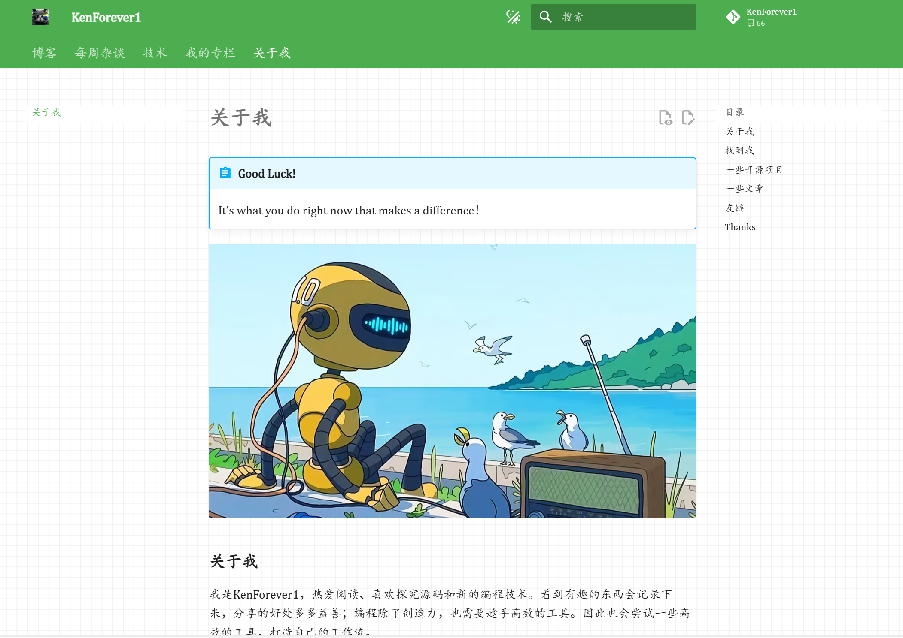

### 介绍

我是KenForever1，热爱阅读、喜欢探究源码和新的编程技术。看到有趣的东西会记录下来，分享的好处多多益善；编程除了创造力，也需要趁手高效的工具。因此也会尝试一些高效的工具，打造自己的工作流。

感谢您的关注和阅读！

### 找到我

在知乎，公众号都可以找到我！

知乎：[SteveForver](https://www.zhihu.com/people/steveforever/columns),互联网大厂程序员，热爱编程和阅读，学无止境

公众号：[陆吾穷奇篇](https://mp.weixin.qq.com/s/EUUGXJIRzGvR0S_1_Wsxpg), 能同途偶遇在这星球上，探索、记录、享受...