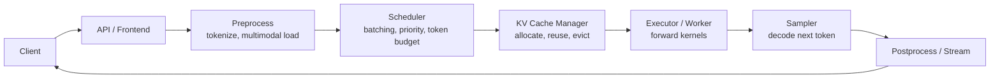
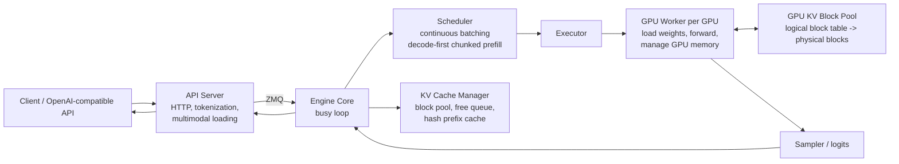
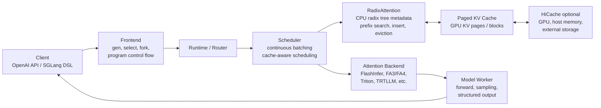
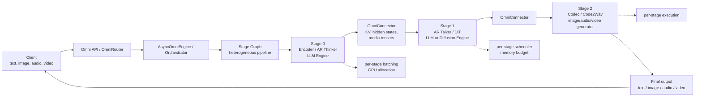
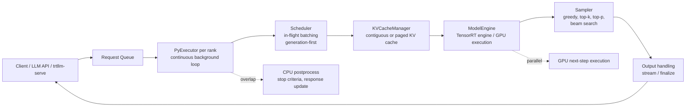

## 摘要

大模型推理框架的竞争，已经不只是“谁的 attention kernel 更快”，而是围绕 **调度、KV cache、批处理、跨阶段解耦、硬件编译优化** 展开的系统工程竞争。

本文从推理框架优化从业者视角，对比 vLLM、SGLang、vLLM-Omni、TensorRT-LLM 的架构、核心调度方法、数据流和特殊设计，并总结它们对推理系统优化的启示。

<!-- more -->

核心结论：

| 框架 | 核心优化视角 | 代表能力 |
|---|---|---|
| vLLM | 把 KV cache 当作“分页内存”管理 | PagedAttention、continuous batching、chunked prefill |
| SGLang | 把复杂 LLM program 的前缀复用变成 runtime 能力 | RadixAttention、cache-aware scheduling、结构化生成 |
| vLLM-Omni | 把多模态 any-to-any 模型拆成异构 stage graph | AR/DiT/codec stage 解耦、OmniConnector、流水化执行 |
| TensorRT-LLM | 面向 NVIDIA GPU 的编译与 runtime 极致优化 | TensorRT engine、IFB、CUDA Graph、Overlap Scheduler |

## 一、共同架构范式

现代 LLM serving 框架大体都收敛到类似结构：

不同框架的差异主要在三个问题上：

1. **请求如何进入 batch**：continuous batching、in-flight batching、decode-first、chunked prefill。
2. **KV cache 如何管理和复用**：paged block、hash prefix cache、radix tree、host/disk/offload。
3. **执行边界在哪里**：单 LLM engine、语言程序 runtime、多模态 stage graph、TensorRT engine。

## 二、vLLM：以 PagedAttention 为核心的通用 LLM serving engine

vLLM 的基础设计来自 PagedAttention，将 KV cache 切成 block/page，以类似操作系统虚拟内存的方式管理非连续显存。PagedAttention 论文指出，传统 KV cache 管理容易因预留、碎片和重复拷贝浪费显存，而 vLLM 通过 block-level 管理提升吞吐与并发能力。参考：[PagedAttention 论文](https://arxiv.org/abs/2309.06180)、[vLLM Architecture Overview](https://docs.vllm.ai/en/latest/design/arch_overview/)。

### vLLM 架构图

vLLM V1 官方文档中，API Server 负责 HTTP 请求、tokenization、多模态数据加载和流式返回；Engine Core 负责 scheduler、KV cache 和 GPU worker 协调；GPU Worker 每 GPU 一个进程，负责权重加载、forward 和 GPU memory 管理。参考：[vLLM V1 Process Architecture](https://docs.vllm.ai/en/latest/design/arch_overview/)。

### 核心调度方法

vLLM 的关键调度是 **continuous batching + decode-first chunked prefill**。

官方优化文档说明，chunked prefill 会把长 prefill 切成更小的块，并与 decode 请求一起 batch；V1 中该能力默认尽可能开启。启用后，调度策略会优先处理所有 pending decode，再在 `max_num_batched_tokens` budget 内调度 prefill；如果 prefill 放不下，就自动切块。参考：[vLLM Optimization and Tuning](https://docs.vllm.ai/en/latest/configuration/optimization/)。

其效果是：

- decode 请求优先，改善 ITL，即 inter-token latency；
- prefill 是 compute-bound，decode 是 memory-bound，混合 batch 有助于提高 GPU 利用率；
- `max_num_batched_tokens` 成为吞吐、TTFT、ITL 的关键旋钮。

### 特殊点

vLLM 的特殊点是 **KV cache manager 设计非常“操作系统化”**。prefix caching 在 KV cache manager 中实现，包含 block pool、free block queue、cache block mapping、request block mapping。新请求会通过 prompt token hash 查找已计算 blocks，再由 scheduler 调用 `allocate_slots()` 分配新 block。参考：[vLLM Automatic Prefix Caching](https://docs.vllm.ai/en/latest/design/prefix_caching/)。

## 三、SGLang：以 RadixAttention 为核心的 language-program-aware runtime

SGLang 的起点不是“单条 chat completion”，而是复杂 LLM program：agent、RAG、多轮对话、self-consistency、tree-of-thought、结构化输出等。它由 frontend DSL 和 backend runtime 组成，核心优化是 RadixAttention。参考：[SGLang blog](https://www.lmsys.org/blog/2024-01-17-sglang/)、[SGLang paper](https://arxiv.org/abs/2312.07104)。

### SGLang 架构图

### 核心调度方法

SGLang 的核心调度是 **RadixAttention + cache-aware scheduling**。

RadixAttention 不只是 prefix cache，而是将 prompt 和 generation result 的 KV cache 保存在 radix tree 中。runtime 收到完整 prompt 后，自动做 prefix search、reuse、insert 和 eviction。SGLang blog 明确提到，RadixAttention 使用 LRU eviction，并配合 cache-aware scheduling 提高 cache hit rate。参考：[RadixAttention 介绍](https://www.lmsys.org/blog/2024-01-17-sglang/)。

这种设计尤其适合：

- 多轮 chat，共享 system prompt 和历史上下文；
- few-shot / benchmark，每条请求共享相同 examples；
- RAG，多个候选答案共享检索上下文；
- Tree-of-thought / agent，多分支共享前缀；
- self-consistency，同一问题采样多个解。

### SGLang 支持 Paged Attention 吗？

支持。更准确地说，SGLang 支持 **paged KV cache / paged attention backend**，并且 RadixAttention 与 paged attention 是不同层级的优化：

- **Paged attention / paged KV**：底层显存布局和 attention kernel 如何访问 KV cache；
- **RadixAttention**：上层如何发现、组织和复用跨请求 prefix KV cache。

SGLang attention backend 文档中有 `Page Size > 1` 支持矩阵，并说明 `page_size` 控制一个 KV cache block 中包含多少 token。`page_size = 1` 前缀复用粒度最细；更大的 page size 通常有更好的 kernel 性能，但需要 prefix token 填满完整 page 才能命中 cache。参考：[SGLang Attention Backend](https://docs.sglang.io/docs/advanced_features/attention_backend)。

### 特殊点

SGLang 的特殊点是 **frontend language 和 backend runtime 协同设计**。用户可以在 DSL 中表达 fork、parallel generation、choice constraints，runtime 则基于这些结构做前缀复用、批处理和约束解码。这使它比纯 serving engine 更接近“LLM application runtime”。

## 四、vLLM-Omni：面向 any-to-any 多模态模型的全解耦 stage serving

vLLM-Omni 解决的问题不同于普通文本 LLM。any-to-any 多模态模型往往同时包含 autoregressive LLM、vision/audio encoder、Diffusion Transformer、codec、TTS 等组件。单一 LLM engine 很难自然表达这种异构 pipeline。参考：[vLLM-Omni 论文](https://arxiv.org/abs/2602.02204)、[vLLM-Omni Architecture Overview](https://docs.vllm.ai/projects/vllm-omni/en/latest/design/architecture_overview/)。

### vLLM-Omni 架构图

### 核心调度方法

vLLM-Omni 的核心不是单 engine 内的 token scheduler，而是 **stage-wise fully disaggregated scheduling**。

它将复杂 omni model 拆成多个 stage，每个 stage 可以由 AR engine 或 diffusion engine 独立服务。stage 之间通过 OmniConnector 传递 KV cache、中间 hidden states 或多模态张量。官方文档提到，Qwen3-Omni 中 Thinker、Talker、Code2Wav 可声明为独立 configured stages，runtime routing 由 Orchestrator 通过 stage clients 完成。参考：[vLLM-Omni architecture](https://docs.vllm.ai/projects/vllm-omni/en/latest/design/architecture_overview/)。

### 特殊点

vLLM-Omni 的特殊点是 **优化对象从 token throughput 扩展为 job completion time 和 pipeline utilization**。

对于多模态模型，瓶颈可能在：

- AR thinker 的 prefill/decode；
- diffusion stage 的 denoising steps；
- audio/video codec；
- stage 间 KV、hidden states、media tensor 传输；
- 不同 stage 的 GPU 配比和队列积压。

因此它的工程启示是：多模态推理系统必须有 stage graph、跨 stage connector、per-stage batching 和资源编排能力。

## 五、TensorRT-LLM：面向 NVIDIA GPU 的编译与 runtime 优化路线

TensorRT-LLM 更接近“硬件贴身”的高性能 serving stack。它围绕 TensorRT engine、CUDA Graph、fused kernels、paged KV cache、in-flight batching 和 overlap scheduler 优化。参考：[TensorRT-LLM Architecture Overview](https://nvidia.github.io/TensorRT-LLM/architecture/overview.html)。

### TensorRT-LLM 架构图

TensorRT-LLM 文档中，`LLM` class 会在每个 rank 创建 PyExecutor worker；PyExecutor 后台循环依次执行 request fetching、scheduling、KV resource preparation、model execution 和 output handling。核心组件包括 Scheduler、KVCacheManager、ModelEngine 和 Sampler。参考：[TensorRT-LLM Architecture](https://nvidia.github.io/TensorRT-LLM/architecture/overview.html)。

### 核心调度方法

TensorRT-LLM 的关键调度是 **in-flight batching + generation-first + overlap scheduler**。

In-flight batching 也叫 continuous batching 或 iteration-level batching，可以让 context phase 和 generation phase 的请求在同一 iteration 中执行，并要求 input tensors packed、去 padding。参考：[TensorRT-LLM IFB](https://nvidia.github.io/TensorRT-LLM/features/paged-attention-ifb-scheduler.html)。

TensorRT-LLM scheduler 还会优先调度 generation phase，请求是否能进 batch 由 `max_batch_size` 和 `max_num_tokens` 控制。文档中说明，`max_num_tokens` 是 remove padding 后每个 batch 的最大 input token 数，会影响 workspace buffer、GEMM 维度、KV cache 可用内存和吞吐延迟平衡。参考：[TensorRT-LLM Request Scheduling](https://nvidia.github.io/TensorRT-LLM/features/paged-attention-ifb-scheduler.html)。

Overlap Scheduler 则让 GPU 提前启动下一步执行，同时 CPU 处理上一步的 stop criteria 和 response update，以减少 GPU idle。参考：[TensorRT-LLM Overlap Scheduler](https://nvidia.github.io/TensorRT-LLM/architecture/overview.html)。

### 特殊点

TensorRT-LLM 的特殊点是 **把很多运行时问题下沉到 TensorRT engine、CUDA Graph 和专用 kernel**。它通常在模型、硬件、batch/SLO 比较明确的生产环境中很强，但灵活性和调试成本也更偏工程重型。

## 六、横向对比

| 维度 | vLLM | SGLang | vLLM-Omni | TensorRT-LLM |
|---|---|---|---|---|
| 核心抽象 | LLM serving engine | LLM program runtime | Omni stage graph | TensorRT execution stack |
| 调度重点 | continuous batching、chunked prefill | cache-aware scheduling | per-stage batching / disaggregation | IFB、generation-first、overlap |
| KV cache | PagedAttention、hash prefix cache | RadixAttention + paged KV | 继承 vLLM KV，并跨 stage 传输 | contiguous / paged KV |
| 最擅长 workload | 通用 chat / completion serving | agent、RAG、多轮、共享前缀 | text-image-audio-video any-to-any | NVIDIA GPU 极致性能 |
| 关键旋钮 | `max_num_batched_tokens`, `max_num_seqs`, block size | `page_size`, radix cache, attention backend | stage config, GPU allocation, connector | `max_batch_size`, `max_num_tokens`, CUDA Graph |
| 优化哲学 | 显存分页与通用吞吐 | 应用结构感知的复用 | 异构 pipeline 解耦 | 编译和硬件深度优化 |

## 七、对推理框架优化的启示

### 1. KV cache 已经是推理系统的中心资源

vLLM 的 PagedAttention、SGLang 的 RadixAttention、TensorRT-LLM 的 paged KV cache、vLLM-Omni 的跨 stage KV/hidden state connector，都说明 KV cache 不再只是模型 forward 的副产品，而是系统级资源。

优化者需要关注：

- KV block/page size；
- cache 命中率；
- eviction policy；
- prefix reuse granularity；
- GPU/CPU/storage 分层；
- 跨 engine、跨 stage、跨节点传输。

### 2. Prefill 和 decode 要分开优化

Prefill 通常 compute-bound，decode 通常 memory-bound。vLLM 的 chunked prefill 和 TensorRT-LLM 的 chunked context 都是在解决长 prompt 抢占 token budget、拖慢 decode 的问题。

实践中要单独观测：

- TTFT：time to first token；
- ITL：inter-token latency；
- TPOT：time per output token；
- throughput；
- tail latency；
- cache hit/miss 后的延迟变化。

### 3. 调度策略决定 SLO，而不只是 kernel 性能

高性能 kernel 如果被糟糕调度包住，仍然会有差的 tail latency。vLLM 的 decode-first、SGLang 的 cache-aware scheduling、TensorRT-LLM 的 generation-first 和 overlap scheduler、vLLM-Omni 的 per-stage scheduling，都是在调度层处理资源冲突。

### 4. 应用结构会越来越重要

SGLang 的成功说明，推理框架不能只看单请求 token 流。agent、RAG、多轮、树搜索、结构化输出都会暴露大量可复用结构。框架如果能理解这些结构，就能减少重复 prefill 和 KV 计算。

### 5. 多模态推理需要 stage graph，而不是“大一统 forward”

vLLM-Omni 的设计表明，AR LLM、DiT、codec、audio/video processor 的资源需求完全不同。未来多模态 serving 的核心会是：

- stage 拆分；
- stage 间 tensor/KV 传输；
- stage queue balancing；
- 异构 GPU 分配；
- pipeline overlap；
- job completion time 优化。

## 八、结论

如果只用一句话概括：

- **vLLM** 教会我们：KV cache 要像操作系统内存一样管理。
- **SGLang** 教会我们：推理 runtime 要理解应用结构和前缀复用。
- **vLLM-Omni** 教会我们：多模态模型要拆成可调度的异构 stage graph。
- **TensorRT-LLM** 教会我们：在确定硬件和模型边界内，编译、CUDA Graph、kernel 与调度协同才能榨干 GPU。

对于大模型推理框架优化来说，未来的核心能力不是单点优化，而是把 **KV cache、scheduler、kernel、pipeline、router、observability** 作为一个整体系统来设计。

## 参考链接

- vLLM Architecture Overview: https://docs.vllm.ai/en/latest/design/arch_overview/
- vLLM Optimization and Tuning: https://docs.vllm.ai/en/latest/configuration/optimization/
- vLLM Prefix Caching: https://docs.vllm.ai/en/latest/design/prefix_caching/
- PagedAttention Paper: https://arxiv.org/abs/2309.06180
- SGLang Blog: https://www.lmsys.org/blog/2024-01-17-sglang/
- SGLang Paper: https://arxiv.org/abs/2312.07104
- SGLang Attention Backend: https://docs.sglang.io/docs/advanced_features/attention_backend
- vLLM-Omni Architecture Overview: https://docs.vllm.ai/projects/vllm-omni/en/latest/design/architecture_overview/
- vLLM-Omni Paper: https://arxiv.org/abs/2602.02204
- TensorRT-LLM Architecture Overview: https://nvidia.github.io/TensorRT-LLM/architecture/overview.html
- TensorRT-LLM Paged Attention, IFB, Scheduling: https://nvidia.github.io/TensorRT-LLM/features/paged-attention-ifb-scheduler.html
