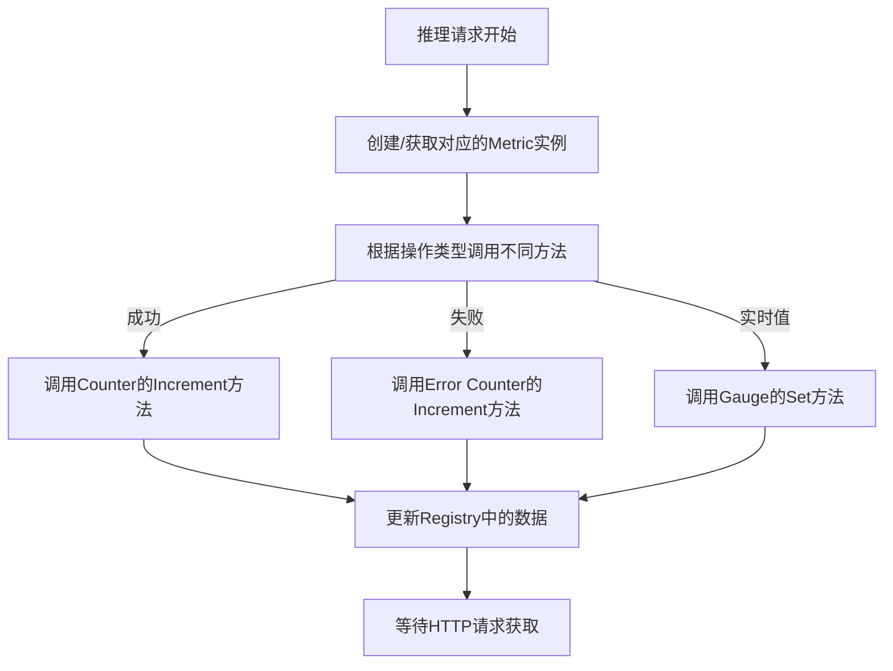
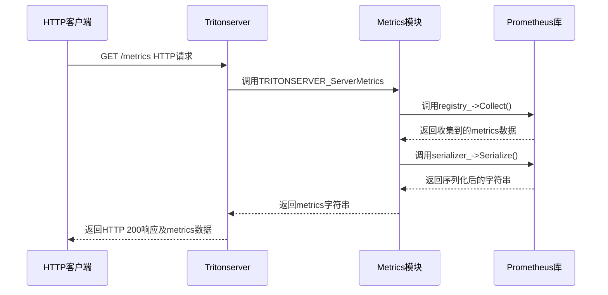

软件监控在现代系统中扮演着至关重要的角色，无论是问题排查还是性能优化，都离不开对metrics、logs和traces的有效监控。本文将深入分析Tritonserver如何实现metrics数据的收集与管理，帮助你理解其内部机制并掌握相关技术细节。
<!-- more -->

> metrics数据的使用方式十分便捷：
> 通过HTTP服务（例如：http://127.0.0.1:8002/metrics）即可获取到metrics数据。由于其格式完全符合Prometheus标准，可以直接与Prometheus对接，再通过Grafana可视化面板进行监控和展示。

## 源码实现概览

在Tritonserver的core仓库中，与metrics相关的实现主要集中在以下几个文件中，它们共同构成了完整的metrics系统：

```c++
metrics.h/cpp: 核心实现文件，提供了全局单例Metrics类，所有metric_family和metric_reporter都依赖于它。该文件实现了metrics的注册、创建、删除、序列化等核心操作，还包含了GPU和CPU信息的收集逻辑。
metric_family.h/cpp: 为Tritonserver自定义扩展metrics提供支持，封装了counter和gauge类型的常用函数（如Increment、Set、GetValue等）以及创建Family的函数。
metric_reporter.h/cpp: 提供了MetricModelReporter类，供Tritonserver内部调用以收集metrics数据。例如，当推理请求成功完成时，相关统计函数会自动调用到MetricModelReporter类。
```

如果你计划为自己的应用实现metrics数据收集功能，这些文件（尤其是metrics.h/cpp）提供了很好的参考模板。在Tritonserver的代码结构中，这部分实现相对独立，易于理解和复用。

## metrics数据的收集机制

Tritonserver通过集成Prometheus的C++库（prometheus-cpp）来实现metrics数据的收集。我们先来看一下这个库的核心接口：

```c++
// 全局唯一的注册表，所有创建的family都会注册到这里
std::shared_ptr<prometheus::Registry> registry_;
// 序列化器，用于将metrics数据转换为字符串格式
std::unique_ptr<prometheus::Serializer> serializer_;

// 定义了几个核心的Family对象，Family是prometheus-cpp库中的模板类
prometheus::Family<prometheus::Counter>& inf_success_family_;
prometheus::Family<prometheus::Gauge>& cache_num_entries_family_;
```

在Prometheus的概念体系中，Family可以理解为一组具有相同名称和帮助信息的指标集合。一个Family对象可以包含多个指标实例，每个实例通过不同的标签来区分。例如，inf_success_family_可以同时统计模型A和模型B的请求成功次数，只需为它们创建不同标签的实例即可。

Family的创建过程如下：

```c++
inf_success_family_(
          prometheus::BuildCounter()
              .Name("nv_inference_request_success")
              .Help("Number of successful inference requests, all batch sizes")
              .Register(*registry_)),
```

对于不同的模型或场景，我们可以通过Add方法为Family添加具有不同标签的Metric实例：

```c++
// 添加一个带有特定labels的metric实例到family中
prometheus::Counter*
MetricModelReporter::CreateCounterMetric(
    prometheus::Family<prometheus::Counter>& family,
    const std::map<std::string, std::string>& labels)
{
  return &family.Add(labels);
}

// 在对象销毁时调用Remove函数移除对应的metric实例
MetricModelReporter::~MetricModelReporter()
{
  Metrics::FamilyInferenceSuccess().Remove(metric_inf_success_);
}
```

Prometheus支持多种指标类型，包括Counter（计数器）、Gauge（实时值）、Histogram（直方图）和Summary（摘要）等，它们都是Family的不同特化形式，适用于不同的统计场景。

为了更直观地理解metrics的收集流程，我们可以通过以下Mermaid流程图来展示：



## metrics数据的获取方式

Tritonserver通过内置的HTTP服务提供metrics数据的访问接口，这部分实现位于开源代码的src/http_server.cc文件中。当客户端发起请求时，系统会调用prometheus-cpp库的序列化接口，将当前的metrics数据转换为字符串格式返回给客户端。

需要注意的是，Tritonserver使用evhtp作为其HTTP库，但在实际应用中你可以选择任何适合的HTTP库来实现类似功能。核心实现逻辑如下：

```c++
void
HTTPMetricsServer::Handle(evhtp_request_t* req)
{
  LOG_VERBOSE(1) << "HTTP request: " << req->method << " "
                 << req->uri->path->full;

  if (req->method != htp_method_GET) {
    RETURN_AND_RESPOND_WITH_ERR(
        req, EVHTP_RES_METHNALLOWED, "Method Not Allowed");
  }

  evhtp_headers_add_header(
      req->headers_out,
      evhtp_header_new(kContentTypeHeader, "text/plain; charset=utf-8", 1, 1));

  // 检查请求路径是否符合API规范
  if (RE2::FullMatch(std::string(req->uri->path->full), api_regex_)) {
    TRITONSERVER_Metrics* metrics = nullptr;
    TRITONSERVER_Error* err = 
        TRITONSERVER_ServerMetrics(server_.get(), &metrics);
    if (err == nullptr) {
      const char* base;
      size_t byte_size;
      err = TRITONSERVER_MetricsFormatted(
          metrics, TRITONSERVER_METRIC_PROMETHEUS, &base, &byte_size);
      if (err == nullptr) {
        // 获取到metrics数据，直接返回给客户端
        evbuffer_add(req->buffer_out, base, byte_size);
      }
    }

    TRITONSERVER_MetricsDelete(metrics);
    RETURN_AND_RESPOND_IF_ERR(req, err);
    TRITONSERVER_ErrorDelete(err);
  }

  evhtp_send_reply(req, EVHTP_RES_OK);
}
```

这里的TRITONSERVER_Metrics是一个C语言风格的空结构体指针，这是Tritonserver将C++实现导出为C语言接口的一种常用方式。这种设计使得跨语言调用和FFI绑定变得更加方便：

```c++
struct TRITONSERVER_Metrics;

TRITONAPI_DECLSPEC TRITONSERVER_Error*
TRITONSERVER_ServerMetrics(
    TRITONSERVER_Server* server, TRITONSERVER_Metrics** metrics)
{
#ifdef TRITON_ENABLE_METRICS
    // TritonServerMetrics是内部真正使用的C++类，这里只是为了调用单例类Metrics的序列化函数
    // 由于使用了new操作，必须提供对应的C语言API进行资源释放
  TritonServerMetrics* lmetrics = new TritonServerMetrics();
  *metrics = reinterpret_cast<TRITONSERVER_Metrics*>(lmetrics);
  return nullptr;  // Success
#else
  *metrics = nullptr;
  return TRITONSERVER_ErrorNew(
      TRITONSERVER_ERROR_UNSUPPORTED, "metrics not supported");
#endif  // TRITON_ENABLE_METRICS
}
```

TRITONSERVER_MetricsFormatted函数负责将metrics数据序列化为字符串，其核心实现位于tritonserver-core仓库的src/tritonserver.cc文件中。最终的序列化操作调用了prometheus-cpp库提供的接口：

```c++
const std::string
Metrics::SerializedMetrics()
{
  auto singleton = Metrics::GetSingleton();
  return singleton->serializer_->Serialize(
      singleton->registry_.get()->Collect());
}

class Metrics {
  std::shared_ptr<prometheus::Registry> registry_;
  std::unique_ptr<prometheus::Serializer> serializer_;
};
```

为了更好地理解metrics数据的完整流程，我们可以通过以下Mermaid时序图来展示：



## Tritonserver自定义metrics

除了内置的metrics外，Tritonserver还支持自定义metrics功能，方便开发者根据实际需求扩展监控能力。这部分功能主要通过metric_family.h/cpp中提供的API实现。

你可以参考官方提供的[custom-metric-example](https://github.com/triton-inference-server/identity_backend/blob/main/README.md#custom-metric-example)来了解如何在自定义backend中实现自定义metrics。核心实现依赖于TRITONSERVER_MetricFamily*和TRITONSERVER_Metric*等API接口，这些接口的源码定义在core仓库的metric_family.h/cpp文件中。

## 其他相关技术

### OpenTelemetry遥测数据收集

[OpenTelemetry](https://opentelemetry.io/docs/languages/cpp/)是一个统一的可观测性框架，支持追踪（Traces）、指标（Metrics）和日志（Logs）三大支柱数据的采集。它通过SDK嵌入应用代码或自动Instrumentation采集数据，并可灵活导出到多种后端系统（如Jaeger、Prometheus等）。

你可以参考OpenTelemetry的[demo-architecture](https://opentelemetry.io/docs/demo/architecture/)了解其完整的架构设计和实现方式。

如果只统计metrics数据，可以使用prometheus-cpp库更简单，依赖更少。如果需要分布式链路追踪，可以使用opentelemetry。

### 简化的metrics服务示例

除了完整的Prometheus集成方案外，我们还可以实现一个简单的metrics服务来快速验证和学习相关概念。以下是一个基于bash和netcat的示例脚本：

```bash
# statistics.sh

#!/bin/bash
# 定义监控间隔（秒）
interval=10

# 获取系统总的CPU使用情况（sy: system, id: idle）
get_sys_cpu_usage() {
    top -bn1 | grep "%Cpu(s)" | awk '{print $4}'  # sy表示系统CPU占用
}

# 获取系统总的CPU空闲占用（id: idle）
get_total_cpu_usage() {
    top -bn1 | grep "%Cpu(s)" | awk '{print $8}'  # id表示空闲CPU占用
}

# 获取系统内存使用率（基于 MemAvailable）
get_memory_usage() {
    total=$(grep MemTotal /proc/meminfo | awk '{print $2}')
    available=$(grep MemAvailable /proc/meminfo | awk '{print $2}')
    used=$((total - available))
    usage=$(echo "scale=2; $used / $total * 100" | bc)
    echo "$usage"
}

# 定义监听的端口（默认 8080）
PORT=8121

# 启动 HTTP 服务函数
start_http_server() {
  echo "Starting HTTP metrics server on port $PORT..."
  while true; do
    # 系统资源
    sys_cpu=$(get_sys_cpu_usage)
    total_cpu=$(get_total_cpu_usage)
    # 计算total CPU使用率，total = 100 - id
    total_cpu_usage=$(awk "BEGIN {print 100 - $total_cpu}")
    # 获取系统内存使用率
    memory_usage=$(get_memory_usage)

    # 使用 nc (netcat) 监听 HTTP 请求
    { 
      printf "HTTP/1.1 200 OK\r\n";
      printf "Content-Type: text/plain\r\n";
      printf "\r\n";  # 空行分隔头和 body
      printf "sys_cpu $sys_cpu\n"
      printf "total_cpu $total_cpu\n"
      printf "total_cpu_usage $total_cpu_usage\n"
      printf "memory_usage $memory_usage\n"
    } | nc -l -p "$PORT" -w 1
  done
}

# 主逻辑
cleanup() {
  echo "Stopping metrics server..."
  rm -f "$METRICS_FILE"
  exit 0
}

trap cleanup EXIT

# 启动 HTTP 服务
start_http_server
```

你可以通过以下命令启动这个简单的metrics服务：

```bash
nohup sh statistics.sh > log_metrics.txt 2>&1 &
```

### Jaeger分布式链路追踪

除了metrics外，分布式链路追踪也是可观测性的重要组成部分。Jaeger是一个开源的分布式追踪系统，提供了强大的链路分析能力。你可以通过[这篇文章](https://www.liwenzhou.com/posts/Go/jaeger/)了解如何在Go语言项目中集成Jaeger。

通过本文的分析，相信你已经对Tritonserver中metrics的实现原理有了深入的理解。无论是使用现成的监控系统还是为自己的项目构建类似功能，这些知识都将对你有所帮助。