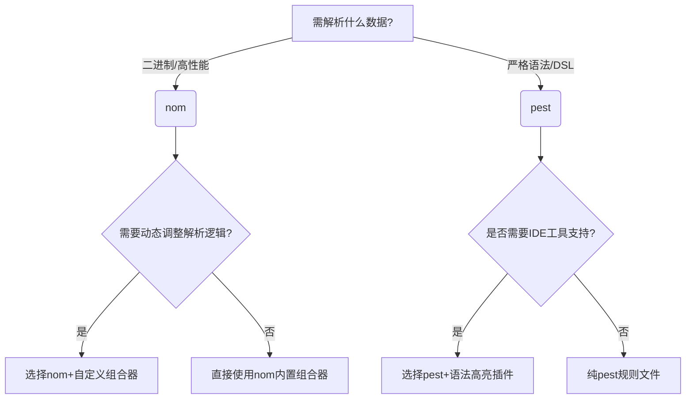

<!-- more -->

## nom和pest解析库设计

nom 和 pest时Rust 生态中两个主流的解析库，但是设计理念和使用方式有显著差异。

### 🔧 nom库：解析器组合库

基于‌解析器组合器‌（Parser Combinators）模式，通过组合小型解析器构建复杂逻辑。
支持‌零拷贝解析‌，直接操作输入数据切片，高效处理二进制或文本。

适用于网络协议解析（HTTP、WebSocket）、自定义二进制格式（如文件头、数据包）
高性能文本处理（CSV、日志）。

对于解析一个cvs文件，首先要使用nom提供的小型解析器，定义如何解析一个field,然后如何解析","号分隔，然后定义如何解析一行，最后定义如何解析一个csv文件。

```rust
// 解析未加引号的字段
fn parse_unquoted_field(input: &str) -> IResult<&str, String> {
    escaped_transform(alphanumeric1, '\\', one_of("\"bfnrt\\")).parse(input)
}

// 单个字段解析
fn parse_field(input: &str) -> IResult<&str, String> {
    parse_unquoted_field.parse(input)
}

// 解析单行CSV数据
fn parse_line(input: &str) -> IResult<&str, Vec<String>> {
    alt((
        // 正常行解析（以换行符结束）
        terminated(
            separated_list0(char(','), parse_field),
            alt((tag("\r\n"), tag("\n"), eof)),
        ),
        // 处理空行
        map(alt((tag("\r\n"), tag("\n"))), |_| vec![]),
    ))
    .parse(input)
}

fn main() { 
    let csv_line = r#"2,Escapedquote,314\r\n"#;

    match parse_line(csv_line) {
        Ok((_, rows)) => {
            for row in rows {
                println!("{:?}", row);
            }
        }
        Err(e) => println!("Parse error: {:?}", e),
    }
}
```

### 📝 pest：基于 PEG 的解析器生成器

使用‌解析表达式文法‌（Parsing Expression Grammar, PEG）定义语法规则。
语法规则与 Rust 代码分离（.pest 文件），提升可读性。

适用于编程语言解析（自定义 DSL），复杂文本格式（配置文件、模板引擎），需要严格语法定义的场景（如编译器前端）。

比如解析一个csv文件：
[pest csv](https://pest.rs/book/examples/csv.html)

定义一个.pest文件描述语法的规则
```bash
field = { (ASCII_DIGIT | "." | "-")+ }
record = { field ~ ("," ~ field)* }
file = { SOI ~ (record ~ ("\r\n" | "\n"))* ~ EOI }
```

## 选择

以解析json为例，nom的性能相比pest的更高一些。

